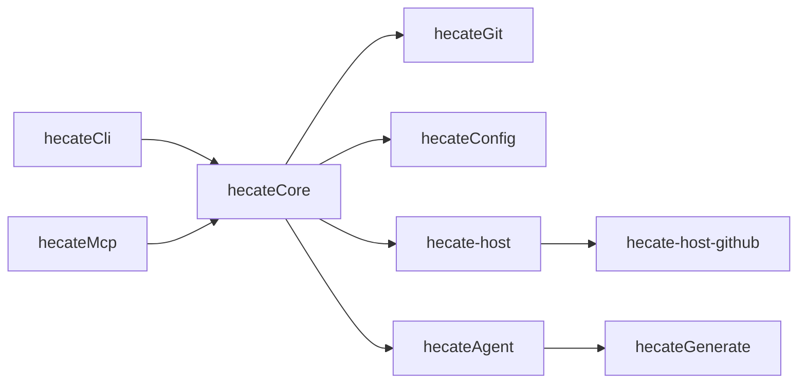

# hecate PRD

Living product requirements. Update as implementation and decisions evolve.

## What This Is

`hecate` is a GitHub-first Rust worktree workflow tool with two public-facing
products:

- `hecate`: a daily-driver CLI for humans
- `hecate-mcp`: an MCP server for AI agents

The goal is to make task-based worktree workflows reliable for both humans and
automation.

This project should not be built as a thin wrapper around `git worktree`.
Instead, it should become a task-aware workflow tool with consistent pathing,
metadata, and structured agent access.

## Core Product Idea

The tool should make these workflows easy:

- start work on a task or issue
- create a correctly named branch and worktree
- keep task/worktree linkage durable
- inspect active worktrees
- remove worktrees safely
- expose worktree and task context to AI agents

## Product Goals

### 1. Great local worktree UX

The CLI should make worktrees practical for daily use, not just technically
possible.

### 2. Durable task context

Each worktree should carry enough metadata to answer:

- what task is this for?
- what branch and base branch does it use?
- when was it created?
- what AI session belongs to it?

### 3. Clean agent integration

The MCP layer should expose a narrow, stable, structured interface for agents.

### 4. GitHub-first, but adaptable

Version 1 should optimize for GitHub, but the core architecture should avoid
baking GitHub-specific concepts into the core domain.

## Non-Goals For V1

Do not optimize for these yet:

- large TUI surfaces
- adapters for additional code hosts beyond GitHub
- database-backed storage
- deep project-management integrations
- broad generation frameworks for every possible AI scaffold

## V1 Product Requirements

### CLI commands

The first public command surface should include:

- `hecate start <task>`
- `hecate list`
- `hecate rm <worktree>`
- `hecate state --json`

### Pathing

All worktrees should use one canonical path model:

- `<base>/<repo-name>/<worktree-name>`

No other pathing behavior should exist in code, docs, or config.

### Config

Use one config system:

- user config at `~/.config/hecate/config.toml`
- optional repo config at `.hecate/config.toml`
- environment overrides on top

### Metadata

Use lightweight repo-local metadata:

- `.hecate/metadata.json`

It should store:

- worktree path
- worktree name
- branch and base branch
- linked task or issue
- timestamps
- optional Claude/Cursor session references

### Automation

Commands should support stable JSON output.

### MCP

The first MCP binary should be named `hecate-mcp` and should expose a small,
stable tool set built on the same application services as the CLI.

## Recommended Architecture

Use a Rust workspace with clear boundaries.

### Terminology

**Code host** — The platform that stores the Git remote and its collaboration
features (issues, pull requests, reviews). Examples: GitHub, GitLab, Gitea. The
`hecate-host` crate holds shared types and traits; each code host gets its own
adapter crate (e.g. `hecate-host-github`) so the core never depends on one
vendor’s API.

### Apps

- `apps/hecate`: user CLI
- `apps/hecate-mcp`: MCP server

### Crates

- `crates/hecate-core`: domain models and application services
- `crates/hecate-config`: config loading and metadata persistence
- `crates/hecate-git`: subprocess-based Git adapter
- `crates/hecate-host`: task and PR abstractions shared across code hosts (no
  vendor-specific APIs)
- `crates/hecate-host-github`: GitHub implementation of those abstractions
- `crates/hecate-agent`: Claude/Cursor session models and later adapters
- `crates/hecate-generate`: future rule/skill/MCP config generation helpers

## Architecture Rules

- `hecate-core` must not know about GitHub API details or depend on
  `hecate-host-github`; it uses the abstractions from `hecate-host` only.
- `hecate-core` must not know where config files live.
- `hecate-git` should use subprocess `git` in v1 for behavior parity with the
  user’s installed Git.
- CLI and MCP must share the same core application services.
- Machine-friendly output should be shaped in one place and reused.

## Features To Borrow

### Borrow from `git-worktree-toolbox`

- persistent worktree metadata
- resumable AI session references
- strong MCP product mindset

Avoid:

- config/docs/runtime drift around pathing

### Borrow from `git-worktree-tools`

- structured JSON command contracts
- explicit state probing before destructive operations
- strong GitHub task and PR workflow ideas

Avoid:

- overlapping config systems
- too many interactive UX approaches early

### Borrow from `git-worktree-runner`

- practical daily-driver ergonomics
- good shell/editor/agent workflow instincts
- explicit config precedence thinking

Avoid:

- Bash-bound architecture

### Borrow from `wtp`

- deterministic path algebra
- typed setup concepts
- staying close to Git primitives

Avoid:

- silent ambiguity around remote resolution

## Rust Guidance

Rust is a good fit because it gives:

- strong architecture boundaries
- reliable refactors
- typed config and output schemas
- single-binary distribution

Rust will be harder than TypeScript/Bash for:

- rapid MCP iteration
- terminal and process-management complexity
- async networked integrations

The right v1 tradeoff is:

- subprocess `git`
- narrow MCP surface
- small config schema
- minimal interactive UX

## Build Order

Build the system in this order:

1. Foundation
2. Local worktree workflow
3. GitHub-first enrichment
4. MCP
5. Agent integrations
6. Generation and scaffolding

Do not jump ahead to advanced MCP or generation work before local CLI and
metadata behavior are solid.

## Story Breakdown

## Epic 1: Foundation

### Story 1: Workspace hygiene

Create a clean Rust workspace with shared dependencies and a reliable
`fmt`/`test`/`clippy` flow.

### Story 2: Config loading

Implement:

- `~/.config/hecate/config.toml`
- `.hecate/config.toml`
- environment overrides

### Story 3: Metadata persistence

Implement versioned metadata at `.hecate/metadata.json` with atomic writes.

## Epic 2: Local Worktree Workflow

### Story 4: Canonical pathing

Implement one authoritative worktree destination function using:

- `<base>/<repo-name>/<worktree-name>`

### Story 5: `hecate start <task>`

Implement:

- task parsing
- branch naming
- worktree creation
- metadata registration

### Story 6: `hecate list`

Implement:

- human output
- `--json`
- metadata-aware task display

### Story 7: `hecate rm`

Implement:

- remove by name
- remove by path
- optional force mode
- metadata cleanup

### Story 8: `hecate state`

Implement state reporting for:

- repo root
- current branch
- metadata path
- configured worktree base
- tracked worktree count

## Epic 3: GitHub-First Workflow

### Story 9: GitHub issue resolution

Add GitHub issue lookup so numeric task references can become rich task
objects.

### Story 10: GitHub-backed task start

Allow `hecate start 123` to enrich task context with GitHub issue data.

### Story 11: PR helpers

Add helpers or commands for opening or creating PRs from task-linked worktrees.

### Story 12: Cleanup by PR state

Add safe cleanup for merged or closed PR-linked worktrees, with dry-run first.

## Epic 4: MCP

### Story 13: MCP server foundation

Build `hecate-mcp` as a real stdio MCP server backed by core services.

### Story 14: Initial MCP tools

Expose:

- `worktree_list`
- `worktree_start`
- `worktree_remove`
- `repo_state`

### Story 15: Task context tools

Expose task and repo context for agent workflows.

## Epic 5: Agent Integrations

### Story 16: Session metadata

Persist provider-specific session references for:

- Claude
- Cursor

### Story 17: Provider adapters

Implement:

- launch
- resume
- provider-specific argument building

### Story 18: Cross-platform session UX

Choose a practical strategy for launching or resuming sessions on Linux, Windows,
and macOS (e.g. delegating to the user’s shell, `xdg-open` / `start` / `open`,
or documented manual flows) without overengineering PTY handling. Platform
quirks belong in provider or OS-specific adapters, not in core assumptions.

## Epic 6: Generation And Scaffolding

### Story 19: Rule generation

Generate and validate basic rule templates.

### Story 20: Skill generation

Generate and maintain reusable skill scaffolds.

### Story 21: MCP config generation

Generate and validate local MCP wiring for `hecate-mcp`.

## Success Criteria

This project is on track when:

- worktree paths are predictable and documented
- task/worktree linkage is reliable
- the CLI is useful even without MCP
- MCP reuses the same business logic as the CLI
- JSON output is stable enough for automation
- GitHub support feels first-class without contaminating the core domain

## One-Paragraph Builder Brief

Build `hecate` as a Rust monorepo with a strong local worktree CLI first and an
MCP/agent layer second. Keep the core free of any single code host’s API details
even though v1 is GitHub-first. The first milestone is a reliable local workflow
with canonical pathing, typed config, repo-local metadata, and stable JSON
output. After that, layer in GitHub issue and PR workflows, then MCP tools,
then Claude/Cursor session support, and finally rule/skill/MCP generation
helpers. The CLI and MCP must share the same core logic, and the architecture
should stay simple enough that another code-host adapter (e.g. GitLab) could be
added later without rewriting the system.
